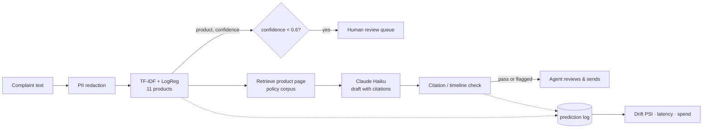

# Complaint Triage — from public data to a deployed, monitored AI service

[](https://github.com/liatmarc/complaint-triage/actions/workflows/ci.yml)
**Live demo:** https://complaint-triage.onrender.com · **API docs:** https://complaint-triage.onrender.com/docs

Consumer complaints arrive as free text. This service routes each one to the right
product team (ML classification) and drafts a grounded first response for an agent
to review (LLM + retrieval), with the guardrails, evaluation and monitoring needed
to run it for real.

Built end to end on the public [CFPB Consumer Complaint Database](https://www.consumerfinance.gov/data-research/consumer-complaints/):
data pipeline → baseline vs. transformer → RAG drafting with an evaluated
hallucination rate → FastAPI + Docker + CI → cloud deployment with drift monitoring.

> The free hosting tier sleeps after 15 minutes idle; the first request may take
> ~45 s to wake. Drafting is capped at $0.50 of LLM spend per day.

## Architecture



## Results

**Routing** — time-based test set, 4,828 complaints, 11 products

| Model | Test macro-F1 | Test acc | Log loss | Inference | Training |
|---|---|---|---|---|---|
| **TF-IDF word+char n-grams + LogReg** (shipped) | **0.757** | 0.816 | **0.599** | **1.7 ms/row (CPU)** | 285 s (laptop CPU) |
| DistilBERT fine-tuned, tuned (512 tok, 3 ep) | 0.756 | 0.821 | 0.614 | 4.3 ms/row (T4 GPU) | 1,394 s (T4 GPU) |

Manual review of the 50 most confident errors: 40 were defensible alternative
labels (complaints that span two products), 2 ambiguous texts, 8 model mistakes —
so the headroom is mostly in the labels. Accuracy rises with narrative length
(72% under 200 chars → 85% over 2,000); fintech companies (Block, PayPal) are
hardest because their products straddle CFPB categories. Full reasoning in
[`reports/phase2/decision.md`](reports/phase2/decision.md).

**Drafting** — 100 stratified test complaints, judged by a different model (Claude Sonnet)

| Condition | Grounding (1–5) | Hallucination rate | Citation check pass | $/draft |
|---|---|---|---|---|
| No retrieval | 1.70 | 98% | 0% | 0.002 |
| Top-4 BM25 chunks | 3.24 | 70% | 54% | 0.002 |
| Whole product page | 3.52 | 51% | 75% | 0.003 |
| **+ cite-the-source prompt** (shipped) | **3.80** | **41%** | **77%** | 0.003 |

Judge agreed with a 20-draft manual spot check on 19/20. Drafts are therefore
delivered *to an agent*, not sent automatically; the deterministic citation check
(80% hallucination when it fails vs. 24% when it passes) flags which drafts need
closer scrutiny. Details in [`reports/phase3/decision.md`](reports/phase3/decision.md).

## What's in the box

| Phase | What it proves | Key files |
|---|---|---|
| 1. Data | streaming ingest of a multi-GB CSV, pandera schema contract, data card, **temporal** split with leakage guard | `ingest.py` `schema.py` `profile.py` `split.py` |
| 2. Modelling | MLflow-tracked baseline vs. transformer, shared evaluation, calibration, hand error analysis, exact linear explanations, slice analysis | `baseline.py` `evaluate.py` `explain.py` `colab_train.py` |
| 3. Applied AI | product-filtered retrieval, PII redaction, citation/timeline check, 4-condition ablation, LLM-as-judge with measured reliability, cost tracking | `retrieval.py` `guardrails.py` `drafting.py` `llm_eval.py` `data/corpus/` |
| 4. Deployment | typed FastAPI + UI, multi-stage non-root Docker image, CI with container smoke test, auto-deploy, PSI drift + latency monitoring, daily spend cap | `api.py` `monitoring.py` `Dockerfile` `.github/workflows/ci.yml` |
| 5. Communication | this README, decision records, one-page write-up | `reports/` |

## Run it yourself

```bash
git clone https://github.com/liatmarc/complaint-triage && cd complaint-triage
python -m venv .venv && source .venv/bin/activate      # Windows: .venv\Scripts\activate
pip install -e ".[dev]" && pytest                      # 21 tests, no data or keys needed

python scripts/phase1.py all --max-rows 50000          # download CFPB data, clean, profile, split
python scripts/phase2.py baseline && python scripts/phase2.py compare
python scripts/phase2.py explain && python scripts/phase2.py slices

cp .env.example .env                                   # add ANTHROPIC_API_KEY
python scripts/phase3.py demo                          # one grounded draft with evidence
python scripts/phase3.py build-eval-set-cmd && python scripts/phase3.py generate --k 12 --condition rag_v3 --skip-no-rag
python scripts/phase3.py judge --condition rag_v3 --no-no-rag && python scripts/phase3.py summarize-cmd --conditions rag_v3

python scripts/phase4.py serve                         # http://127.0.0.1:8000
docker build -t complaint-triage . && docker run --rm -p 8000:8000 --env-file .env complaint-triage
python scripts/phase4.py monitor                       # drift / latency / spend from the prediction log
```

Transformer fine-tuning runs on a free Colab GPU (`scripts/colab_train.py`);
predictions are scored locally with the same evaluator as the baseline.

## Decisions I'd defend in an interview

- **Time-based split, not random.** Production scores the future; a random split
  leaks vocabulary and category trends and overstates accuracy.
- **Shipped the simpler model.** DistilBERT tied the baseline at 5× the training
  cost and 2.5× the latency, and error review showed the ceiling is in the labels.
- **Retrieval recall before ranking.** The corpus is small enough to give the model
  the entire product page; that beat top-k BM25 by 19 points of hallucination.
- **Human-in-the-loop, with evidence.** 41% hallucination is too high to auto-send,
  so the product is a draft plus its excerpts plus a flag, not an autoresponder.
- **Measure the judge.** An LLM judge is only as good as its agreement with humans;
  a spot check caught it silently failing on two-thirds of rows and corrected the
  headline number from 32% to 51%.

## Limitations and next steps

- Trained on a ~51k-row recent slice; the full 1.5M-row dataset would likely favour
  the transformer. The pipeline re-runs at full scale with no code changes.
- The policy corpus is a fictional playbook grounded in real federal rules
  (FDCPA, Reg E, Reg Z, RESPA, FCRA); a real deployment would index the
  institution's own procedures.
- Next: structured per-claim citations to push hallucination below 20%, a
  retraining job triggered by the PSI drift alert, and a small labelled set of
  agent edits to measure how much time the drafts actually save.

## Layout

```
src/complaint_triage/   pipeline, models, RAG, API, monitoring (one module per concern)
scripts/                phase1..phase4 CLIs, Colab trainer, CI stub
tests/                  21 offline tests (synthetic data, fake LLM client)
data/corpus/            policy playbook (12 markdown pages)
reports/                data card, decision records, evaluation summaries
```
