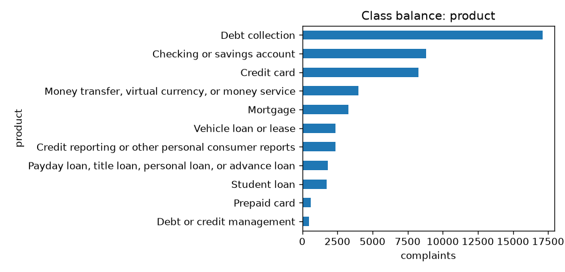
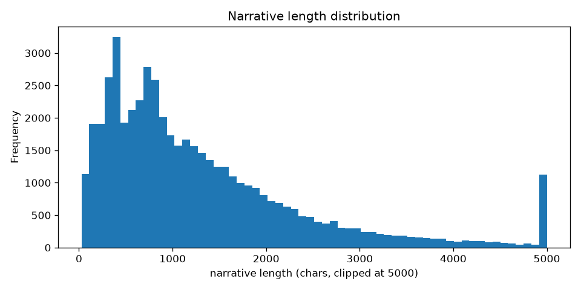
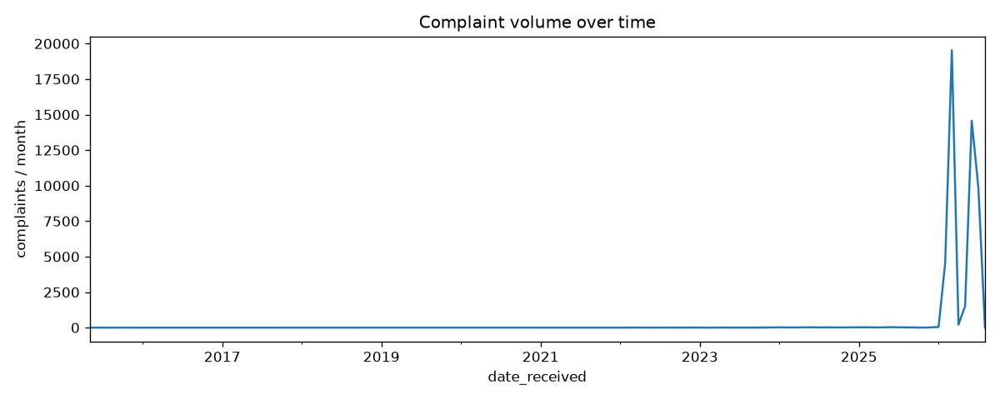
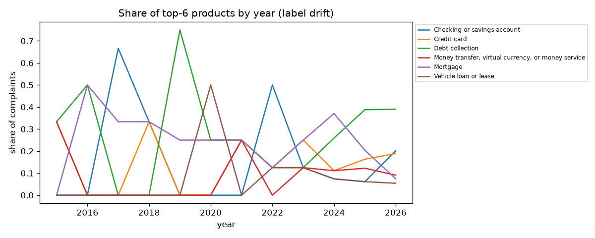

# Data card: CFPB consumer complaints (narratives only)

**Source:** https://files.consumerfinance.gov/ccdb/complaints.csv.zip
**Rows after cleaning:** 50,868
**Date range:** 2015-05-15 to 2026-08-11
**Target:** `product` (11 classes)

## Key facts
- Majority class: **Debt collection** (33.6% of rows)
- Rarest class: **Debt or credit management** (492 rows) — imbalance ratio 34.8:1
- Narrative length: median 979 chars, p95 3652 chars
- Exact-duplicate narratives: 5,159
- Distinct companies: 1,715

## Cleaning applied
- Kept only complaints with a consumer narrative of at least 20 chars
- Dropped rows with missing product, complaint ID or unparseable date
- De-duplicated on complaint ID
- Validated against `schema.CleanSchema` (pandera)

## Known caveats
- Narratives are only present when the consumer opted in, so this is a biased subset of all complaints.
- CFPB has renamed and merged product categories over the years; see the drift chart below.
- Narratives are redacted by CFPB (`XXXX` tokens) — treat those as a feature, not noise.

## Class distribution
| product                                                 |   count |   share |
|:--------------------------------------------------------|--------:|--------:|
| Debt collection                                         |   17097 |   0.336 |
| Checking or savings account                             |    8821 |   0.173 |
| Credit card                                             |    8293 |   0.163 |
| Money transfer, virtual currency, or money service      |    3980 |   0.078 |
| Mortgage                                                |    3292 |   0.065 |
| Vehicle loan or lease                                   |    2383 |   0.047 |
| Credit reporting or other personal consumer reports     |    2377 |   0.047 |
| Payday loan, title loan, personal loan, or advance loan |    1816 |   0.036 |
| Student loan                                            |    1730 |   0.034 |
| Prepaid card                                            |     587 |   0.012 |
| Debt or credit management                               |     492 |   0.01  |

## Missing values
|                  |   missing % |
|:-----------------|------------:|
| date_received    |         0   |
| product          |         0   |
| sub_product      |         0   |
| issue            |         0   |
| sub_issue        |        12.4 |
| narrative        |         0   |
| company          |         0   |
| state            |         0.8 |
| submitted_via    |         0   |
| company_response |         0   |
| timely_response  |         0   |
| complaint_id     |         0   |
| narrative_len    |         0   |

## Figures

